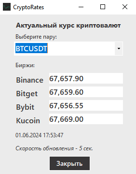

# CryptoRates

### About

This is a Desktop App for tracking some crypto symbols rates from the crypto exchanges based on [CryptoExchange.Net](https://jkorf.github.io/CryptoExchange.Net/) library (implement different cryptocurrency API's).

Nowadays the App gets information from 4 crypto exchanges:

- Binance,
- Bitget,
- Bybit,
- Kucoin.

There are 3 cryptocurrency symbols for tracking:

- BTCUSDT
- ETHUSDT
- SOLUSDT

When needed new exhanges and symbols can be easy added.

### App's Stack

1. NET Core 8
1. Windows Forms
1. Web Sockets
1. CryptoClients.Net 1.1.0
1. Serilog 4.0.0

### Interval of Rates Updating - 5 Seconds.

### How to Install on Windows

Use file **crypto_rates_setup.exe** in folder **./installer**

### App's UI

